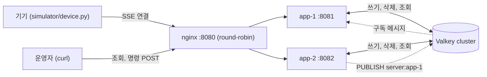

# device-registry

***"기기와의 연결 정보를 서버 메모리에 들고 있는데, 서버를 늘리면 어떻게 되나?"*** 에 대한 답을 동작하는 코드와 실험 로그로 만든 프로젝트.

Spring Boot App 2EA, nginx 라운드로빈, Valkey 클러스터로 구성했다.
개인 규모의 실험이고, 인증, UI, 배포는 다루지 않는다.

## 문제

특정 기기들은 서버가 먼저 말을 걸어야 하는 순간이 있다(ex. 테이블오더), 주문 상태가 바뀌었을 때, 품절을 반영할 때, 카운터에서 결제 요청을 띄울 때다. 
그래서 기기는 서버와 오래 열어 두는 연결(SSE)을 맺는다. 이 연결은 서버 프로세스 한 곳에만 있다.

서버가 한 대일 때는 문제가 없다. 여러 대가 되면 세 가지가 깨진다.

- "지금 어떤 기기가 온라인인가"를 물으면 서버마다 다른 답을 한다. 각자 자기 연결만 알기 때문이다.
- "7번 기기에 결제 요청을 띄워라"가 7번의 연결을 쥐지 않은 서버에 도착하면 보낼 수 없다.
- 서버 한 대가 죽으면 그 서버가 알던 연결 정보가 함께 사라지고, 다른 서버는 그 사실을 모른다.

## 구조



| 정보 | 있는 곳 | 둘이 다를 때 |
|---|---|---|
| 실제 연결 | 각 서버의 맵. 기기 id → (연결, epoch) (`DeviceConnectionManager`) | 이쪽을 믿는다. 그 서버만 안다 |
| 누가 어느 기기를 쥐고 있는지 | Valkey `device:{id}` 해시. `server_id`, `epoch`, `status`, `last_seen` (TTL 30초) | 위의 맵 내용을 다른 서버에 알리려고 적어 둔 메모. 틀리면 이쪽을 고친다 |
| 한 번이라도 연결한 기기 목록 | Valkey `devices:known` SET | 해시가 만료된 기기를 OFFLINE으로 보여 주기 위한 목록 |

동작 규칙은 네 가지다.

1. **기록은 연결을 쥔 서버만 쓴다.** 연결 직후 한 번, 그 뒤로는 10초마다 기기에 ping을 보내고 성공하면 기록의 TTL을 연장한다. 서버가 죽으면 연장이 멈추고 기록은 저절로 사라진다. ([ADR-0003](docs/adr/0003-server-side-lease-renewal.md))
2. **쓸 때마다 연결 번호(epoch)를 비교한다.** 연결마다 맺어진 시각을 번호로 붙인다. 기록된 번호가 내 것보다 크면 쓰지 않고 그 연결을 닫는다. 먼저 쓴 쪽이 아니라 나중에 연결된 쪽이 이긴다. ([ADR-0006](docs/adr/0006-connection-epoch-for-lease-writes.md))
3. **조회는 Valkey만 읽는다.** 그래서 어느 서버에 물어도 답이 같다. ([ADR-0001](docs/adr/0001-shared-registry-in-valkey.md))
4. **명령은 기록을 보고 연결을 쥔 서버에게만 보낸다.** 받은 서버가 그 연결을 쥐고 있으면 바로 보내고, 아니면 그 서버만 듣는 채널 `server:{server_id}`에 발행한다. ([ADR-0005](docs/adr/0005-command-routing-via-pubsub.md))

## 실행

```bash
cp .env.example .env            # VALKEY_NODES, VALKEY_PASSWORD 채우기
./gradlew bootJar

SERVER_ID=app-1 SERVER_PORT=8081 java -jar build/libs/device-registry-0.0.1-SNAPSHOT.jar
SERVER_ID=app-2 SERVER_PORT=8082 java -jar build/libs/device-registry-0.0.1-SNAPSHOT.jar

nginx -p $PWD/nginx -c nginx.conf          # 종료: nginx -p $PWD/nginx -s stop

python3 simulator/device.py --url http://localhost:8080 --count 3
```

| 요청 | 설명 |
|---|---|
| `GET /devices/{id}/events` | SSE. 이 요청을 받은 서버가 그 기기의 연결을 쥔다. `connected`, `ping`, `command` 이벤트를 보낸다 |
| `GET /devices`, `GET /devices/{id}` | 상태 조회. 어느 서버에 물어도 같은 답 |
| `POST /devices/{id}/command` | 기기에 명령 전달. 본문을 그대로 보낸다. 202 `DELIVERED` 또는 `PUBLISHED`, 404 `OFFLINE`, 409 `NOT_CONNECTED` |

## 실험 결과

설정은 TTL 30초, ping 10초. 앱 2대와 nginx, 시뮬레이터는 같은 호스트에서 돌렸고 Valkey는 VPN 너머에 있다. 전체 로그는 [docs/experiments](docs/experiments)에 있다.

| 실험 | 결과 |
|---|---|
| 기기가 app-1에 붙어 있을 때 app-2에 조회 | 두 서버의 응답이 바이트 단위로 같음 |
| 기기를 `kill -9` | 13초 뒤 서버가 ping 쓰기 실패로 알아채고 맵과 기록을 지움 |
| 서버를 `kill -9` | 1초 뒤 기기가 다른 서버에 다시 붙고 기록의 `server_id`가 바뀜 |
| 서버와 기기를 동시에 `kill -9` | 지울 주체가 없는 기록이 TTL 만료로 29초 뒤 사라짐 |
| 죽은 서버를 다시 띄움 | 4초 뒤부터 새 연결을 다시 받음. 다른 서버나 설정은 건드리지 않음 |
| 연결을 쥐지 않은 서버에 명령 POST | 약 20ms 뒤 기기가 받음. nginx를 거쳐 보낸 것도 모두 도착 |
| 기기 `kill -9` 후 1초 안에 재시작 | 35초 동안 조회 결과가 옛 서버로 되돌아간 적 없음 (아래 "발견한 결함") |

### 서버가 죽으면 기기가 옮겨가고 명령이 따라간다

```
01:19:05      app-1 kill -9  (dev-1, dev-2가 app-1에 있었음)
01:19:05.473  [dev-1] SSE closed: server closed the stream / reconnecting in 1s
01:19:06.495  [dev-1] connected to server=app-2
01:19:06      조회: dev-1~4 모두 app-2

$ curl -X POST localhost:8082/devices/dev-1/command -d after-failover
202 {"outcome":"DELIVERED","serverId":"app-2"}
[dev-1] event=command data=after-failover
```

### 연결을 쥐지 않은 서버에 보낸 명령

```
$ curl -X POST localhost:8082/devices/dev-1/command -d '{"action":"lock"}'      # dev-1은 app-1에 있음
202 {"outcome":"PUBLISHED","serverId":"app-1"}

03:30:13.231  app-2: Command published: id=dev-1, to=app-1
03:30:13.250  app-1: Command delivered from channel: id=dev-1
03:30:13.250  [dev-1] event=command data={"action":"lock"}
```

## 발견한 결함과 수정

첫 검증에서 설계의 구멍을 찾았다. 기기를 죽이고 1초 뒤 다시 띄웠더니, 실제 연결은 app-1에 있는데 조회는 8초 동안 app-2를 가리켰다.

```
02:59:10  옛 기기 kill -9 (옛 연결은 app-2에 있었음)
02:59:13  새 기기가 app-1에 연결. server_id=app-1
02:59:21  app-2가 끊긴 연결에 보낸 ping이 "성공" → 갱신이 server_id를 app-2로 덮어씀
02:59:29  app-1의 갱신이 다시 app-1로
02:59:32  app-2가 끊김을 알아챔
```

원인은 "연결을 쥔 서버는 자기 연결이 끊긴 것을 바로 안다"는 가정이었다. TCP에서 `write()`의 성공은 커널 버퍼에 넣었다는 뜻일 뿐이라, 끊긴 연결에 보낸 ping도 한두 번은 성공으로 돌아온다. 그 사이 옛 서버가 새 연결의 기록을 덮어썼다.

연결마다 번호(epoch)를 붙이고, 쓸 때 "기록된 번호가 내 것보다 크면 쓰지 않는다"를 Lua 스크립트 안에서 비교하도록 고쳤다 ([write_if_newest.lua](src/main/resources/scripts/write_if_newest.lua)). 거부당한 서버는 그 연결을 스스로 닫는다. 같은 조작을 다시 했을 때 조회 결과는 한 번도 되돌아가지 않았다.

더 나쁜 순서도 확인했다. 옛 연결이 살아 있는 상태에서 키가 만료되고 옛 연결이 먼저 써 버린 경우다. `server_id`만 비교하는 방식이었다면 여기서 새 연결이 닫혔을 것이다.

```
01:18:32.555  기록: server_id=app-1 (옛 연결 쪽, 일부러 틀리게 만든 상태)
01:18:36.278  app-1: ping 쓰기는 성공, 갱신은 거부 → 옛 연결을 스스로 닫음
01:18:36.295  app-2: 갱신 성공 → 기록이 app-2로 돌아옴
              새 연결은 끊기지 않음
```

과정은 [1차 검증](docs/experiments/2026-10-01-stage1-verification.md), [수정 후 검증](docs/experiments/2026-10-02-epoch-verification.md), [ADR-0006](docs/adr/0006-connection-epoch-for-lease-writes.md)에 있다.

## 한계

| 한계 | 영향 |
|---|---|
| 서버가 죽은 뒤에도 그 서버의 기록이 ONLINE으로 남는다 | 최대 TTL 30초 (실험에서 29초). 기기가 재연결하면 그 순간 끝난다 |
| 그 사이 그 서버의 기기로 보낸 명령은 사라진다 | 보낸 쪽은 202를 받는다. 명령 응답은 "발행했다"까지만 뜻한다 |
| 명령을 받은 서버가 기록을 읽은 직후 기기가 다른 서버로 옮기면 그 명령은 사라진다 | 읽기부터 전달까지 약 20ms(실험 결과)의 창. 옛 서버에 경고 로그가 남는다 ([백로그 0009](docs/backlog/0009-forward-command-once.md)) |
| 소리 없이 죽은 기기를 늦게 알아챈다 | 기기의 프로그램만 죽고 운영체제가 살아 있으면 ping 한두 번, 실험에서 13~17초. 기기의 운영체제가 서버의 ping에 "그런 연결은 없다"고 거절 응답을 돌려주기 때문에 빨리 안다. 기기 전원이 꺼지거나 네트워크가 끊겨 응답해 줄 쪽이 아예 없으면, 서버는 답을 기다리며 다시 보내다가 포기한 뒤에야 알고 수 분이 걸린다. 실험은 같은 컴퓨터에서 프로그램만 `kill -9` 했으므로 앞의 경우이고, 실제보다 유리한 조건이다 |
| 키가 만료된 상태에서 옛 연결이 먼저 쓰면 기록이 잠깐 틀린다 | 최대 ping 주기 10초 (실험에서 4초) |
| 서버끼리 시계가 재연결 간격(1초)보다 크게 어긋나면 새 연결이 거부될 수 있다 | 기기가 한두 번 더 재연결하고 끝난다. 실험은 같은 호스트라 재현하지 않았다 |
| 서버 한 대를 재배포하면 그 서버의 기기가 한꺼번에 재연결한다 | 재연결 지연에 무작위성을 주지 않았다 |
| `devices:known` SET이 계속 자란다 | 정리하지 않는다 |

## 검토했지만 고르지 않은 방법

- **기록 연장을 위한 하트비트를 기기에서 생성**
 설계 초안. 하트비트는 nginx를 거쳐 아무 서버에나 도착하므로, 받은 서버는 그 기기가 어느 서버에 붙어 있는지 말할 수 없다. ([ADR-0003](docs/adr/0003-server-side-lease-renewal.md))

- **웹소켓 하나로 양방향을 처리**
 주문 같은 기기 → 서버 요청까지 그 연결을 타면, 요청 처리도 연결을 쥔 서버에 묶인다. SSE와 일반 HTTP 요청으로 나누면 요청은 아무 서버나 처리할 수 있다. ([ADR-0002](docs/adr/0002-sse-for-server-to-device.md))

- **nginx가 기기 id로 명령을 보낼 서버를 결정(일관 해싱)** 
연결과 명령이 같은 서버에 도착하므로 명령을 보낼 때 기록을 읽을 필요가 없다. 실무에서는 좋은 답이지만 이 프로젝트가 다루려는 것 자체를 없앤다. ([ADR-0006](docs/adr/0006-connection-epoch-for-lease-writes.md))

- **명령을 모든 서버에 뿌리고, 연결을 쥔 서버만 반응** 
기록을 읽지 않아도 되어 단순하고, 서버가 적거나 매장 전체에 알리는 일이 많으면 이러한 결정이 낫다. 현재 설계에서는 어차피 상태 조회 때문에 기록이 있고, 그 기록으로 한 서버에만 보내면 보내는 쪽이 오프라인 여부를 바로 알 수 있어서 좁혀 보내는 쪽을 골랐다. 비교표는 [ADR-0005](docs/adr/0005-command-routing-via-pubsub.md)에 있다.

- **명령의 도착 여부 확인** 
하지 않았다. Pub/Sub는 듣는 쪽이 없으면 메시지를 버린다. ([백로그 0007](docs/backlog/0007-command-ack.md))

## 문서

- [docs/PRD.md](docs/PRD.md)
    - 요구사항 정의서(무엇을 왜 만드는가, 체크리스트, 실험 계획)
- [docs/adr](docs/adr)
    - 설계 결정 건들과 그 이유
- [docs/experiments](docs/experiments)
    - 시각이 찍힌 실험 로그 세 편
- [docs/backlog](docs/backlog)
    - 미완된 피처들
